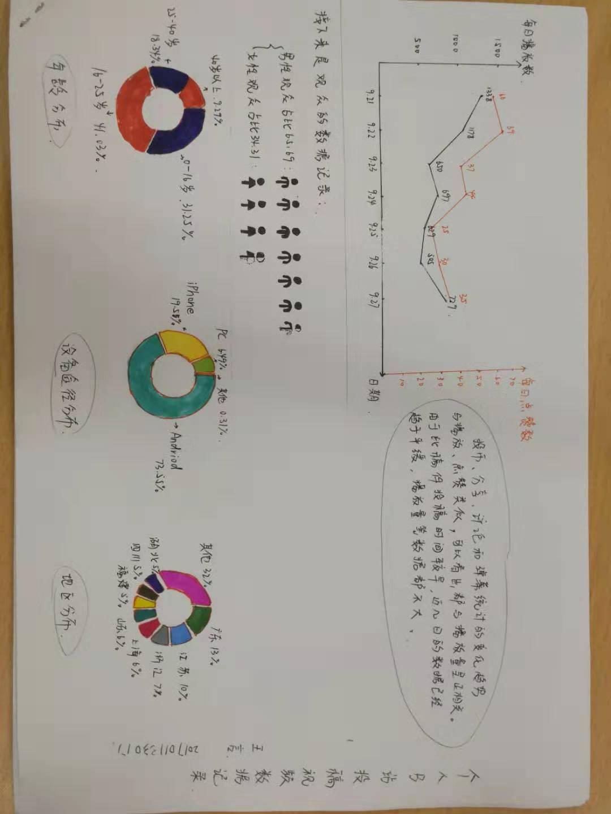

第3次作业

<mark>
  [数据集]（https://www.kaggle.com/eliasdabbas/gold-reserves-by-country-quarterly）
  
  使用工具：图表秀、文图、百度图说
  
  呈现：
&emsp;&emsp;
</mark>

第2次作业

<mark>
1.《上海市公共数据和一网通办管理办法》(http://wap.sh.gov.cn/nw2/nw2314/nw2319/nw2407/nw45024/u26aw62638.html) 《福建省政务数据管理办法》《成都市公共数据管理应用规定》《政府信息公开条例》等。
  
  参考链接：http://www.pkulaw.cn/fulltext_form.aspx?Gid=1510206959
  
  北京市政务数据资源网，上海市政府数据服务网，开放广东，广州市政府数据统一开放平台，苏州市政府数据开放平台，浙江政务服务网“数据开放”专题网站等。
  
  参考链接：http://www.tanmer.com/blog/451
2.2012：8.1%，7.6%，7.4%，7.9%
  2013：7.7%，7.6%，7.7%，7.7%
  2014：7.4%，7.5%，7.3%，7.4%
  2015：7.0%，7.0%，6.9%，6.8%
  2016：6.7%，6.7%，6.7%，6.8%
  2017：6.8%，6.8%，6.7%，6.7%
  2018：6.8%，6.7%，6.5%，6.4%
  
  统计指标：国内生产总值当季值
  
  数据页面：http://data.stats.gov.cn/easyquery.htm?cn=B01
  
  计算步骤：用当季度GDP减去上季度GDP，再除以上季度GDP即可
</mark>

第1次作业

<mark>
  
&emsp;&emsp;在本次数据的记录和与其他同学的交流中，我更明显地意识到生活中所有事情都是可以以数据的形式进行收集的，而不仅仅是一些类似数据新闻、市场分析的大事才有必要进行数据统计，这也加深了我对数据的敏感，希望今后能在这一方面学到更多。

&emsp;&emsp;在今天这个网络、信息高度发达的时代，公民的很多个人信息都会被收集。诸如网络上喜欢浏览哪类消息、视频；最近是否买了车、车险；网购时的消费倾向和消费习惯等。同时我们的很多社会行为都会被网络记录下来。收集这些信息的人不尽相同，总的来说主要是服务于我们的媒体、应用；有利益关系的商家；政府出于国家利益和社会利益方面的考虑下也会进行记录收集，等等。
</mark>

